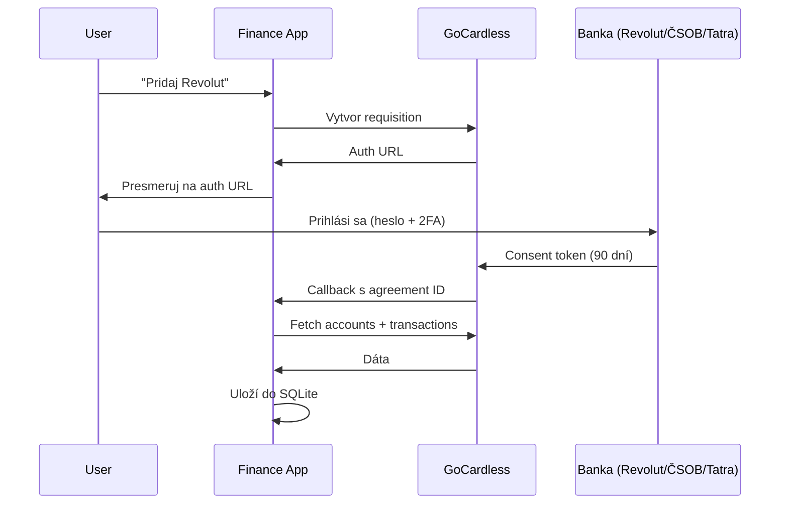

---
tags:
  - project/finance
  - tech/integration
---

# GoCardless Bank Account Data

[[00 - Overview|← Späť na Overview]]

## Čo to je

**GoCardless Bank Account Data** (predtým **Nordigen**, akvírovaný 2022) je **open banking aggregator** pod EU PSD2 reguláciou. Read-only prístup k bankovým transakciám.

> [!important] NIE je to banka
> Nič cez to nepresúvaš, žiadne peniaze. Je to len "čítačka" tvojich existujúcich bankových účtov.

## Pricing

- **Free tier:** 100 requestov/deň/účet — pre osobné použitie **bohato stačí**
- Pri syncu každých 6h = 4 volania/deň/účet → ďaleko v limite
- **Komerčné použitie** (SaaS pre ostatných userov) = paid plan, začína ~€0.30/account/mesiac

## Flow: ako funguje autorizácia

## Čo appka (a GoCardless) NIKDY nevidí

- ❌ Tvoje bankové heslo
- ❌ 2FA kódy
- ❌ PIN
- ❌ Možnosť poslať platbu / zmeniť nastavenia účtu

## Čo appka získava

- ✅ Zoznam účtov (IBAN, mena, názov)
- ✅ Balance
- ✅ Transakcie (date, amount, merchant, description)
- ✅ Historická história (**90 dní štandard, niektoré banky až 730**)

## Re-autorizácia každých 90 dní

> [!warning] **Dôležité!**
> Po 90 dňoch consent expiruje a **musíš znova kliknúť cez bank login**. Je to **EU zákon (PSD2 + SCA)**, nie rozhodnutie GoCardless.

### Čo sa deje po expirácii

1. Sync vráti error `consent expired`
2. **Dáta v SQLite ostávajú nedotknuté** — nič sa nestratí
3. Appka pošle **notifikáciu** (email alebo ntfy push)
4. Klikneš link → bank login → potvrdíš ďalších 90 dní → hotovo

### Časová náročnosť

- ~2–3 min **na banku**
- 3 banky × raz za 90 dní = **~10 minút práce za štvrťrok**

## Bank-specific poznámky

| Banka | Max lookback | Delay | Poznámka |
|-------|--------------|-------|----------|
| Revolut | 90 dní | minúty | Najrýchlejší, začneme s ním |
| ČSOB SK | 90 dní | hodiny až deň | Občas zvláštnosti v auth flow |
| Tatra banka | 90 dní | hodiny | Stabilné, ale pomalšie |

## Reputácia / Security

- Regulovaní v EU ako **AISP** (Account Information Service Provider)
- **SOC 2 Type II + ISO 27001** certifikácie
- Valuation ~$2B (2024)
- Používajú ich YNAB, Emma, a ďalšie populárne finance appky
- **Žiadny veľký publikovaný breach** (stav k 2026-01)

## Kroky pri nasadení (pre mňa)

1. [ ] Registrácia na https://gocardless.com/bank-account-data
2. [ ] Vygenerovať Secret ID + Secret Key v dashboarde
3. [ ] Uložiť do `.env` na RPi
4. [ ] Test: list supported institutions pre SK
5. [ ] Revolut requisition flow (prvá banka)
6. [ ] Až keď Revolut funguje → pridať ČSOB, Tatru
